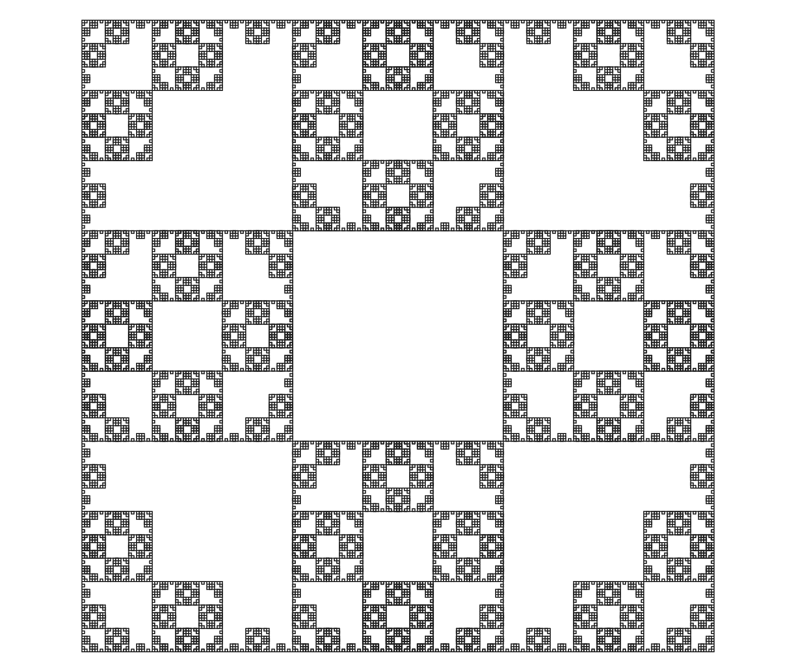

# algorithmic-botany

A simple plant modeling web application.

Try it out [here](https://anthony-calandra.com/ab).

## Examples

| Example 1 | Example 2 |
|--|--|
|  |  |
| Iterations: 6; Angle: 20; L-system: `F`; Rules: `F -> F[+F]F[-F][F]` | Iterations: 4; Angle: 90; L-system: `-L`; Rules: `L -> LF+RFR+FL-F-LFLFL-FRFR+`, `R -> -LFLF+RFRFR+F+RF-LFL-FR` |
|  |  |
| Iterations: 5; Angle: 90; L-system: `F-F-F-F`; Rules: `F -> FF-F-F-F-FF` | Iterations: 3; Angle: 90; L-system: `F+F+F+F`; Rules: `F -> F+f-FF+F+FF+Ff+FF-f+FF-F-FF-Ff-FFF`, `f -> ffffff` |

## AI Disclaimer

This project was created with the help of AI tools. The code in this project is not production-quality and does not represent the code I would write or allow pass code review in a professional capacity.

## References

See https://algorithmicbotany.org/ for some really neat publications.
